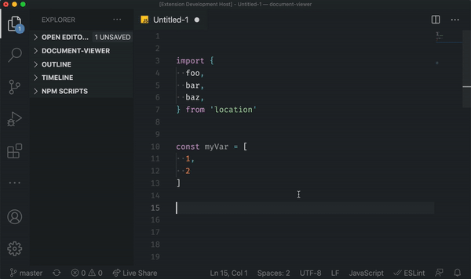

# Onelineify

Onelineify tackles those annoying moments when you have an object or an array broken out onto multiple lines but you really don't need that and you'd prefer it was just on one line. Now you can fix it quickly.

## Extension Settings

This extension contributes the following settings:

* `onelineify.maxLineLength`: Defaults to 120. If a onelineified line would be longer than this value, onelineifying is prevented.
* `onelineify.padCurlyBraces`: Defaults to true. Ensures a single space after an opening `{` and before a closing `}`
* `onelineify.padSquareBrackets`: Defaults to false. Ensures a single space after an opening `[` and before a closing `]`

## Known Issues

None so far!

## Release Notes

### 0.0.1

Initial release!
